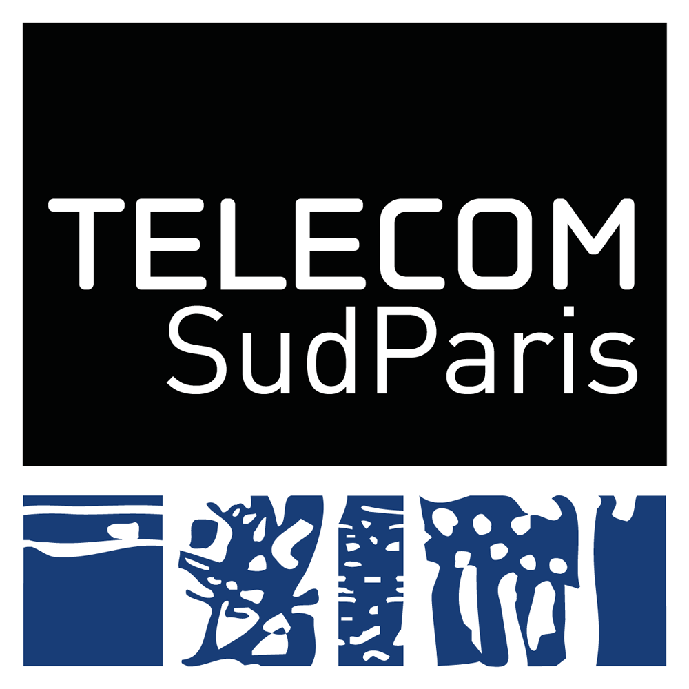
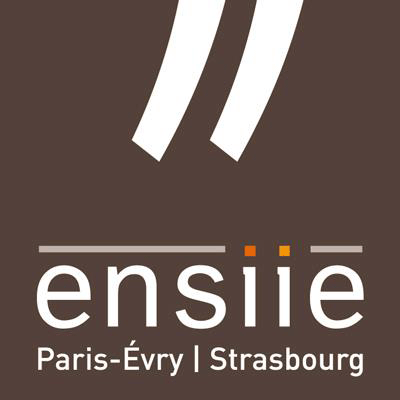
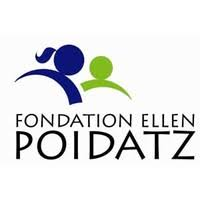
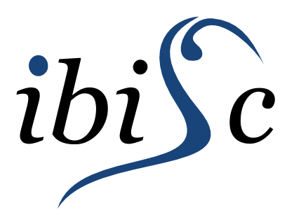

# CP-ARRoW

  La rééducation à la marche des enfants atteints de paralysie cérébrale est cruciale pour qu’ils puissent réapprendre à se déplacer normalement. Mais c’est un processus éprouvant pour les patients, à la fois physiquement et mentalement. Il peut donc être difficile de les motiver à marcher par eux-mêmes sur leur temps libre. Notre projet CP-ARRoW, soutenu par la fondation Ellen Poidatz, leur donne une motivation supplémentaire pour marcher grâce à un jeu en réalité augmentée, qui fonctionne avec un simple casque à poser sur la tête. Il nous permet d’afficher des objets virtuels intéressants dans le monde réel, pour motiver les enfants à se déplacer pour chercher les objets. Le jeu est spécifiquement adapté à leurs besoins, avec des interactions simples et ludiques, et l’application permet de récupérer des données comme la distance de marche parcourue, pour qu’elles puissent ensuite être utilisées par le personnel médical pour améliorer encore sa rééducation.

Pour plus d'information, cf le manuel d'utilisation ( VI Fonctionnement d'application )

Vidéo de présentation :  https://youtu.be/cLGPpgfIBxE

    
